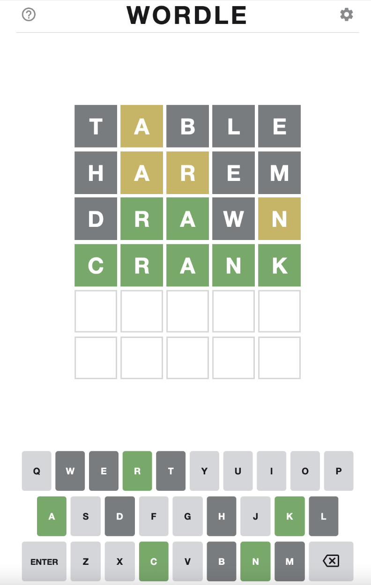
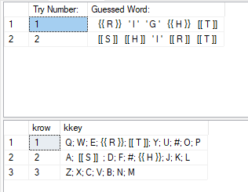
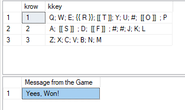

# Popular Wordle game for T-SQL 

Popular word guessing game - Wordle written in T-SQL. Github repository gives you T-SQL Code  for Microsoft SQL Server for this popular game, using your favorite editor.

Game outlook and design is based on the concept of https://powerlanguage.co.uk/wordle/ 

Original Wordle gameplay outlook:
<div style="text-align:center"></div>

## About the game

It is a word guessing game. You have to quess the Wordle in six (or less) tries. Words must be in the thesaurus list, based on the dictionary. A letter that is correctly guessed (position and letter) turns green (in T-SQL version, the letter is enclosed in [[ A ]]), a letter that is correct but placed in wrong wrong position turns yellos (in T-SQL version, the letter is enclosed in {{ A }}) and an incorrect letter turns gray (in T-SQL version, the letter is enclosed in ' A ').


## Installation

Game has a single procedures. The initialization of the thesaurus (list of the words for a given language) is done by running the script ```setup.SQL```.

You will be able to install the language pack with:
```
BULK INSERT dbo.TempWords
--FROM '/Users/tomazkastrun/Documents/tsqlwordle/languages/english.txt' -- Linux
FROM 'C:\DataTK\git\tsqlwordle\languages\english.txt' -- Windows
WITH (FIRSTROW = 1
    ,ROWTERMINATOR='\n');	
-- (1384 rows affected)

SELECT 
     word
    ,'EN' as lang
 FROM TempWords;
```
Github repository offers four language packs:
1. English
2. German
3. Slovenian
4. Italian

And each language pack has also the keyboard layout available in the table:
```
DROP TABLE IF EXISTS dbo.Keyboard;
GO
CREATE TABLE dbo.Keyboard
(
    ID INT IDENTITY(1,1)
    ,Krow INT NOT NULL
    ,Kkey NVARCHAR(100) NOT NULL
    ,lang CHAR(3) NOT NULL
)

INSERT INTO dbo.Keyboard
SELECT 1, 'Q; W; E; R; T; Y; U; I; O; P', 'EN' UNION ALL
SELECT 2, 'A; S; D; F; G; H; J; K; L', 'EN' UNION ALL
SELECT 3, 'Z; X; C; V; B; N; M', 'EN' UNION ALL
SELECT 1, 'Q; W; E; R; T; Z; U; I; O; P; Š; Đ', 'SI' UNION ALL
SELECT 2, 'A; S; D; F; G; H; J; K; L; Č; Ć; Ž', 'SI' UNION ALL
SELECT 3, 'Y; X; C; V; B; N; M', 'SI'  UNION ALL
SELECT 1, 'Q; W; E; R; T; Z; U; I; O; P; Ü', 'DE' UNION ALL
SELECT 2, 'A; S; D; F; G; H; J; K; L; Ö; Ä', 'DE' UNION ALL
SELECT 3, 'Y; X; C; V; B; N; M', 'DE'   
SELECT 1, 'Q; W; E; R; T; Z; U; I; O; P', 'IT' UNION ALL
SELECT 2, 'A; S; D; F; G; H; J; K; L', 'IT' UNION ALL
SELECT 3, 'Y; X; C; V; B; N; M', 'IT'   
```

The second file is  ```Game.SQL``` that consists of single procedure. This procedure creates complete gameplay and ends after the word is found or user runs out of six tries.


## Playing the game

Running the game by using the procedure in english language pack and with the first try:

```
-- Initial Try
	EXEC dbo.WordGuess 
		 @lang='EN'
		,@guess = 'right'
```     

After the initial run, you have to find a clever way to find the next 5-letter word following the clues that SQL Server returns; Green letters in [[ ]] and yellow letters in {{ }}

```
-- Second Try
	EXEC dbo.WordGuess 
		 @lang='EN'
		,@guess = 'shirt'
```

<div style="text-align:center"></div>

After the second try, this looks very good and the final word should be '''short'''.

```
-- Third Try
	EXEC dbo.WordGuess 
		 @lang='EN'
		,@guess = 'short'
```
And you win the game!

<div style="text-align:center"></div>


## Forking or cloning the repository
To work in GitHub, go to https://github.com/tomaztk/tsqlwordle and fork the repository. Work in your own fork and when you are ready to submit to make a change or publish your sample for the first time, submit a pull request into the master branch of this repository. 

You can also clone the repository. Note: further changes should be fetched manually.

Feel free to collaborate on the language pack and add more languages.


```
git clone -n https://github.com/tomaztk/tsqlwordle 
```

## Code of Conduct
Collaboration on this code is welcome and so are any additional questions or comments.


## License
Code is licensed under the MIT license.
